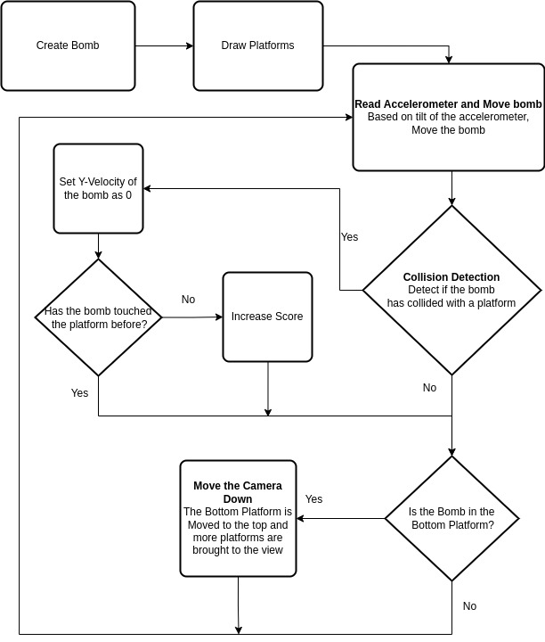

# Oopsy Bombsy

Dr. Round is an astronaut on the ISS in the year 2203. While on a space walk, Dr. Round accidentally dropped a bomb that he held and now the bomb is on its way hurling to hit Earth. 

An object when dropped in space can hit the earth with so much force that it releases enough energy to annihilate the earth. 

Luckily the international space agency had preventive measures just in case such a situation arises. It had a series of rocket powered platforms that help to slow down the speed of the ball before it annihilates the earth. but due to poor maintainance a few of these platforms can trigger the bomb to explode. 

Can you save the earth by aiding the bomb to fall gracefully?

## Required Devices

1. Arduino UNO
2. ADXL345 Accelerometer
3. 1.44" TFT Display
   
## Connections 

Follow these links to connect the arduino to the the sensors - 

1. [Connect Arduino with Accelerometer](https://pimylifeup.com/arduino-accelerometer-adxl345/)
2. [Connect Arduino with TFT Display](https://www.instructables.com/Using-TFT-144-With-Arduino-Nano/)

## Playing the game

Upload new_game/new_game.ino to the arduino to play the game on the tft screen.

## Overview of how the Game Functions

This is a platform game where the end goal of the user is to get the bomb as close to the earth as possible. We start by first setting the stage by drawing the bomb and the platforms after which the game's event loop is initiated. In each loop we read the accelerometer values and based on the tilt of the accelerometer we move the bomb. While the bomb is in motion we check if the bomb has collided with any of the platforms. If it hasnt we let the ball fall. If it has, we then check if it has been resting on the platform or it has just landed on the platform. If the case is the latter we increase the score, else we continue the game. If we notice that the bomb has hit the bottom platform, then we move the camera downwards by raising the bottom most platform to the first platform and introducing new platforms.

